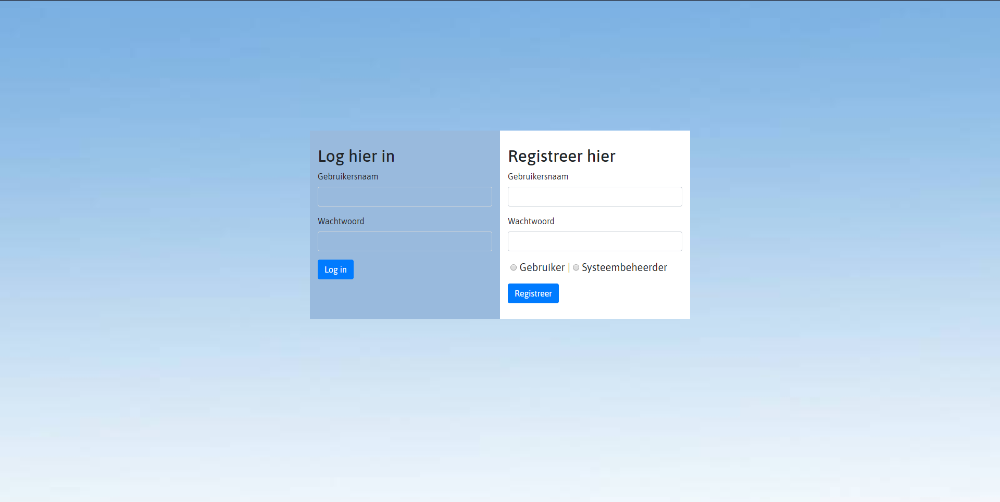
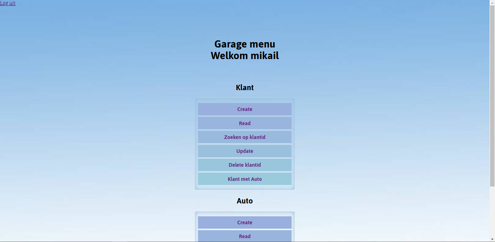
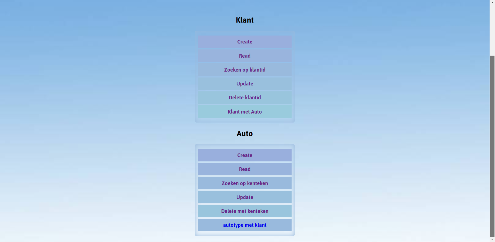
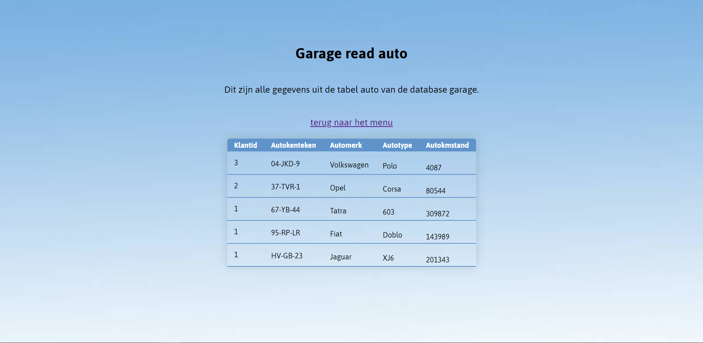

# Garage database-php
 Installatie
 
 1.Installeer XAMPP of WAMPP.
 2.Open XAMPP en start Apache en MySql.
 3.Download dit project : https://github.com/mikail2002/Garage-database-php/ .
 4.Zet de files in xammp\htdocs.
 5.Download de garage.sql.
 6.Import deze in phpmyadmin.
 7. Registreer een account.
 8.Login

# Screenshots

